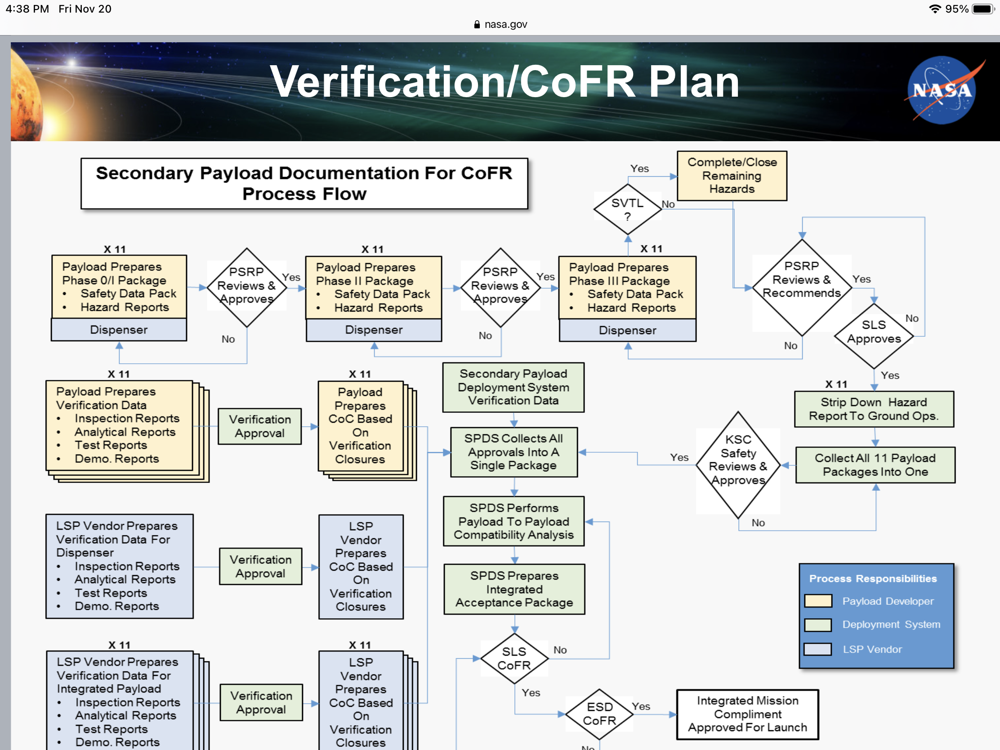

# NASA Cubesat Quest
NASA has a number of activities for organizations to participate in NASA objectives for Moon, Earth and Mars scientific objectives. 
Most of these are beyond the ability of where we are with CubeSats but they also have a references page that could prove useful.

[NASA Cubesat Quest](https://www.nasa.gov/cubequest/detail) has a [References page](https://www.nasa.gov/cubequest/reference/).
There are a number of file there mostly on the CubeQuest competition but some of the files provide information on more CubeSat generic topics.

I found the [CubeQuest town hall meeting #2](https://www.nasa.gov/sites/default/files/atoms/files/townhall2_10_21_15.pptx) which was all about NASA's CubeSat
safety review process and some details about the forms and information that needed to provide interesting.  

Here is an image of one of the charts from the townhall meeting. 
