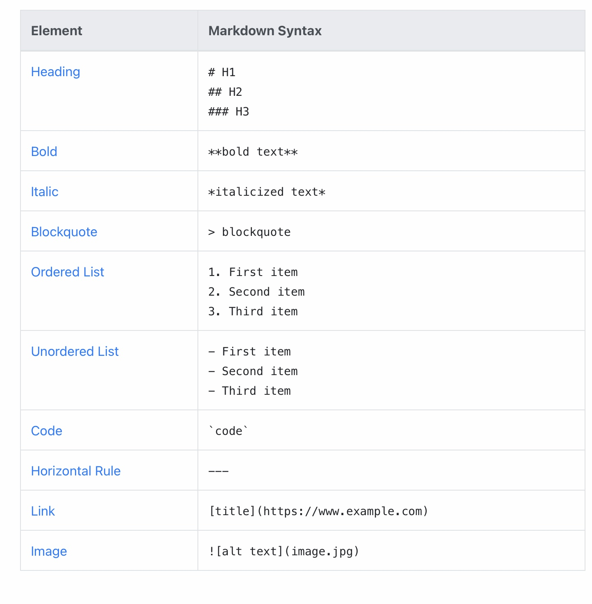

# PRA Robotics CubeSat Project

This repository contains documentation, resources, and submissions for the 
2020/2021 PRA Robotics CubeSat Challenge.

## NASA CubeQuest
See our [NASA CubeSat Quest](NASA-CubeQuest.md) Document on NASA Cubesat competition

## Mission Propsoal
See our [Mission Proposal](proposal.md) Document (format of document from CTE Challenge Phase 1)

## Flight Reports
See our [Reports](reports.md) Document for detailed accounts of test flights

## RPi Battery Power
Has information about current hardware environment (pg 2), some power draw information for RPi's (pg 3), some battery specifications (pg 4), and links for the source of the information I supplied.

## Markdown helpful hints
Here's a [markdown help page](https://www.markdownguide.org/basic-syntax).

And a cheatsheet for MarkDown syntax. 

## [Judging_rubrik](Judging_rubrik.md)
This is information out of the CTE Mission: Cubesat website on how they plan to judge the mission proposal

